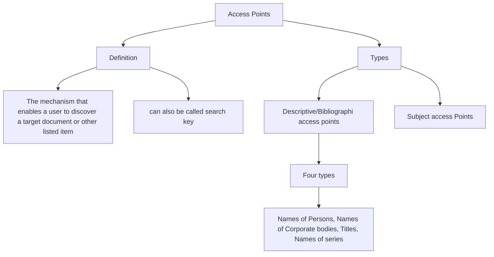

---
{"dg-publish":true,"permalink":"/01-notes/choices-of-access-points-headings-for-persons-geographic-names-and-uniform-titles-in-aacr-2/","dg-note-properties":{"date":"September 30, 2026","domain":"[[LIS 61]]","parent":"[[01 - Notes/AACR2]]","tags":null,"sources":null}}
---

# Introduction

>[!column|flex 2 no-i ttl-c] # Assignment of Descriptive/Bibliographic Access Points - Main Entries
>>[!blank] 
>>### **Conditions of authorship**
>>- Works for which a single person or corporate body is responsible
>>- Works of unknown or uncertain authorship or by unnamed groups
>>- Works of share responsibility
>>- Collections and works produced under editorial direction
>>- Works of mixed responsibility
>>  
>> ### **Main entry under Personal Author**
>> - **Single personal authorship**
>>- **Shared responsibility**
>>1. Principal author (kung sinong author may pinaka-maraming ambag)
>>2. First named author
>>>[!aside|wm-tl right]-
>>>- for **2-3 authors only**
>>>- if responsibility is shared between two or three persons if no principal author is indicated
>> - **Mixed responsibility**
>> 1. Adapter for a paraphrase, rewriting, adaptation for childred, or version in a different literary form
>> 2. Writer of the text for a work that consists of a text for which an artist has provided illustrations
>> 3. Artist for a separately published illustration
>> 4. Original author for an edition that has been revised, elarged, updated
>> 5. Reviser of an edition if the original authr is no longer considered to be responsible for the work
>> 6. Commentator of a work consisting of a text and a commentary by a different person, if the latter is emphasized
>> 7. Author of the text of a work consisting of a text and a commentary by a different person, if the text is emphasized
>> 8. Original author of a translation
>> 9. Biographer-critic of a work by a writer accompanied by (or interwoven with) biographical or critical material, if the latter is emphasized
>> 10. Writer of a work accompanied by (interwoven with) biographical or critical material by another person who is presented as editor, compiler, etc
>
>
> >[!blank]
>> ### **Main entry under Corporate Body**
>>1. Internal policies, procedures, and/or operations, its finances, its officers and/or staff, or its resources
>>2. Some legal, governmental, and religious works of the following types:
>>- Laws
>>- Decrees of the chief executive that have the force of the law
>>- Administrative regulations
>>- Constitutions
>>- Court rules
>>- Treaties
>>- Court decisions
>>- Legislative hearing
>>- Religious Laws
>>- Liturgical works
>>1. Works that record the collective thought of the body
>>2. Collective activity of a conference
>>3. Sound recordings, films, video recordings, written records, etc. of performance resulting from the collective activity of a performing group as a whole where the responsibility of the group goes beyond that of mere performance, execution, etc.
>>4. Cartographic materials
>>5. Official communications
>>### **Main entry under Title**
>>- Works that do not fall into the categories of works that require main entry under a person or corporate body
>>1. Personal authorship is unknown, uncertain, diffuse (4+ authors with no principal authorship), or cannot be determined, and the work does not emanate from a corporate body
>>2. Collection or work produced under editorial direction that has a collective title
>>3. Emanates from a corporate body but does not fall ito any categories listed and is not of personal authorship
>>4. Accepted as a sacred scripture

>[!column|flex 2 no-i ttl-c] # Assignment of Descriptive/Bibliographic Entries - Added Entries
>>[!blank]
>>- To increase retrievability of bibliographic records
>>- Secondary Entries
>>## Added entries under Personal Names
>>- Made for the following:
>>	- Collaborators (up to 3)
>>>[!aside|wm-tl right]-
>>>if there are 4+ collaborators, added entry is made for the first named only
>>	- Writers
>>	- Editors and compilers
>>	- Translators
>>	- Illustrators
>>	- Persons related to the work in a way other than being responsible for the creation of the content of the work
>>
>>## Added entries under Corporate Names
>>- Prominently named in the work unless it functions solely as distributer or manufacturer
>>- if 4+ corporate bodies are involved, first named only
>
>>[!blank]
>>## Added entries under Titles
>>- it has not been used as a main entry
>>- The title added entry is so similar as to duplicate the main entry heading or a reference to the main entry heading
>>- Any other title (cover title, caption title, etc) that differs significantly from the title proper
>>
>>## Added entries under Series
>>- added entry under the heading for a series for each separately catalogues work if the series if it provides a useful collocation, except if:
>>	- items in the series are related to each other only by commn physical characteristics
>>	- numbering suggests that the parts have been numbered primarily for stock control or to benefit from lower postage rates
>>- if in doubt, make a series added entry

>[!info|bg-c-red] Choice of Name
>- In general, choose the name by which a person is **commonly known**
>- If a person is known by **more than one name** (other than a pseudonym) choose the name by which the person is clearly most **commonly known**, if there's one
>- If all the works by one person appear under one pseudonym, choose the pseudonym

>[!info|bg-c-red] Uniform Title
>- The particular title by which a work is to be identified for cataloguing purposes
>- Uniform titles provide the following purposes:
>1. Gather together all entries for a work when various manifestations of it have appeared under various titles
>2. To identify a work when a title by which it is known differs from the title proper of the item being catalogued
>3. To differentiate between two or more works published under identical titles
>4. To organize the file

>[!column|flex 2 no-i ttl-c] # Formulating Uniform Title
>>[!blank]
>>- General rule: Enclose the uniform title in square brackets
>>- **Works created after 1500:** Use the title or form of title in the original language by which a work has become known through use in manifestations of the work or in reference sources
>>>[!example|bg-c-blue]
>>>[Hamlet]
>>>(Title proper: The tragicall historie of Hamlet, Prince of Denmarke)
>>- **Works created before 1501:** Use the title, or form of title, in the original language by which a work... is identified in modern sources
>>- If the title in modern sources is uncertain, use the title most frequently found in this order of preference
>>(1) modern editions
>>(2) early editions
>>(3) manuscript copies
>>>[!example|bg-c-blue]
>>>[Beowulf]
>>>(Title Proper: Beowulf and the fight at the Finssburg)
>>
>>- For Classical and Byzantine Greek works: Use a well-established English title
>>- If there's no English title, use the Latin title
>>- If neither English title nor Latin title is well-established, use the Greek title
>>>[!example|bg-c-blue]
>>>[Iliad]
>>>(An epic poem by Homer; Freek title: Ilias)
>>>
>>>[Odyssey]
>>>(An epic by Homer, sequel to the Illiad; Greek title: Odysseia)
>>
>>- For anonymous works written neither in Greek nor in Roman script before 1501: use an established English title if available
>>>[!example|bg-c-blue]
>>>[Arabian nights]
>>>(also known as One Thousand and One Nights)
>
>> [!blank]
>>- Add the name of the language to the uniform title of the item being catalogued if the language is different from that of the original
>>>[!example|bg-c-blue]
>>>[Odyssey. French]
>>>[Othello. German]
>>>[Macbeth. Filipino]
>>
>>- One part of a work
>>>[!example|bg-c-blue]
>>>[Two towers]
>>>[Iliad. Book 1]
>>>[Odyssey. Book 2]
>>
>>- More than one part
>>>[!example|bg-c-blue]
>>>[Iliad. Book 2]
>>>(the item contains books 2 and 4 of Iliad)
>>
>>- For collective titles
>>- Uniform title is: [Works]
>>- If selected works: [Selections]
>>>[!example|bg-c-blue] Literary form
>>>[Correspondence]
>>>[Essays]
>>>[Poems]
>>>[Novels]
>>>[Novels. Selections]
>>>[Plays. Selections]
>>
>>- For the Bible
>> >[!example|bg-c-blue]
>> >[Bible]
>>>[Bible. N.T.]
>>>[Bible. O.T. Pentateuch]
>>>[Bible. N.T. Gospels]
>>>[Bible. N.T. Mark]
>>>[Bible. English. Authorized. 2003]
>>>[Bible. N.T. Corinthians. English. New King James. 1999]
>>
>>

>[!info|bg-c-red] Formatting the Bibliographic Record in Card Catalog Format
>- **Include the main entry and added entry headings in the bibliographic record**
>	- Main entry headings (name and corp body) are placed above the bibliographic description
>	- Added entry headings are placed below the bibliographic desc; also called as "tracings," for main entry cards
>		- each tracing starts with a Roman numeral (desc and biblio access points) or an Arabic numeral for (subject access points)
>		- if the added entry is the title proper, use "Title" instead of the exact title proper
>		- if the added entry is the series, use "Series" instead of the exact series title
>		- For variations of title and other related titles, use the exact title
>	- Above the main entry headings, for added entry cards
>		- if the added entry is the title proper, use the title proper as it is for the added entry heading
>		- if the added entr is the series title, use the series title as it is for the added entry heading
>- Use the levels of indentation for each paragraph in the bibliographic record
> - Use the appropriate type of indentation:
> 	- Paragraph
> 		- Personal name and corp body as main entry
> 	- Hanging
> 		- Title as main entry
> - The number of catalog cards needed for each bibliographic resource depends on the following:
> 	- Main entry
> 	- number of added entries
> 	- number of subject headings

# Examples
>[!cards|2] Examples
>**Parts of the Card Catalog Record (main entry)**
>
>
>**Parts of the Card Catalog Record (added entry)**
>
>
>**Levels of indentation**
>
>
>**Examples of Title added entry for main entry under personal author (Single Authorship)**
>

